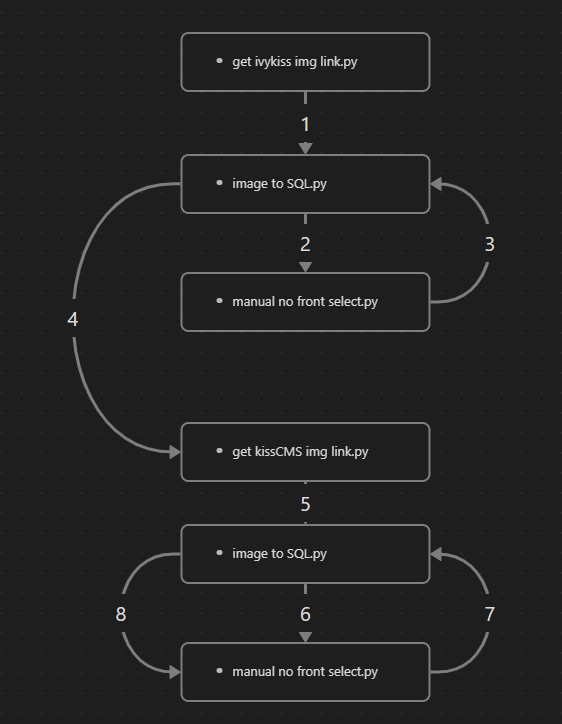
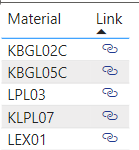
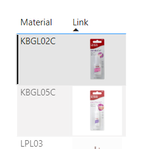

## Flow Chart

- get ivykiss img link.py, get KissCMS img link.py code use celenium and beutifulsoup to get image links.
- image to SQL.py read 'Product Photo.csv' file and upload it to sku_image table in SQL server.
-  manual no front select.py reads 'front_check_list.csv' file and show image links for users to select the image link to upload. Save the image links to no front tag_selected.csv file.

Using this codes instead of checking the image links manually saves times a lot.

# How to use the image links in Power BI
1. Use it as URL icon
    1. import the image link table
    2. Select the link column. Select 'Date category' as 'Web URL'  

    
    3. Add 'Link' to the table as Data in the report view. In the Format panel, select value in URL icon menu.  

      

    
2. Use it as a normal image in Power BI
    1. Select the link column. Select 'Date category' as 'Image URL'  

      

    2. In this method, max size are 150px and 150px.
3. Use it with HTML content
    1. Create a new measure   
`selected image html = "`
    2. Add new visual type 'HTML content'
    3. Select the 'HTML content' and add the created measure
    4. You can set the width and height as you want by editing the style in measure.