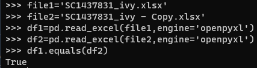

## python code

```python
import pandas as pd
file1='example file 1.xlsx'
file2='example file 2.xlsx'
df1=pd.read_excel(file1,engine='openpyxl')
df2=pd.read_excel(file2,engine='openpyxl')
df1.equals(df2)
```

