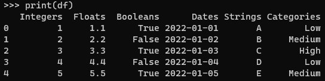
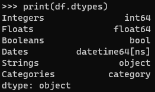

## python code

```python
import pandas as pd
# Create a dictionary with data for each column
data = {
    'Integers': [1, 2, 3, 4, 5],
    'Floats': [1.1, 2.2, 3.3, 4.4, 5.5],
    'Booleans': [True, False, True, False, True],
    'Dates': pd.date_range(start='2022-01-01', periods=5, freq='D'),
    'Strings': ['A', 'B', 'C', 'D', 'E'],
    'Categories': pd.Categorical(['Low', 'Medium', 'High', 'Low', 'Medium'])
}
# Create a DataFrame from the dictionary
df = pd.DataFrame(data)

# Print the DataFrame
print(df)
```


- Check the data types of each column in the DataFrame
``` python
print(df.dtypes)
```
- dtype shows the type of each column of the dataframe or Series.

